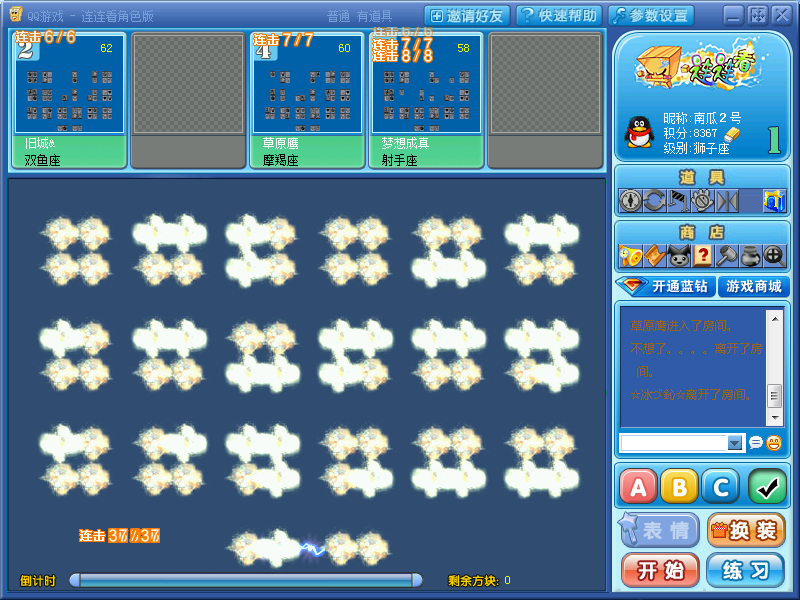
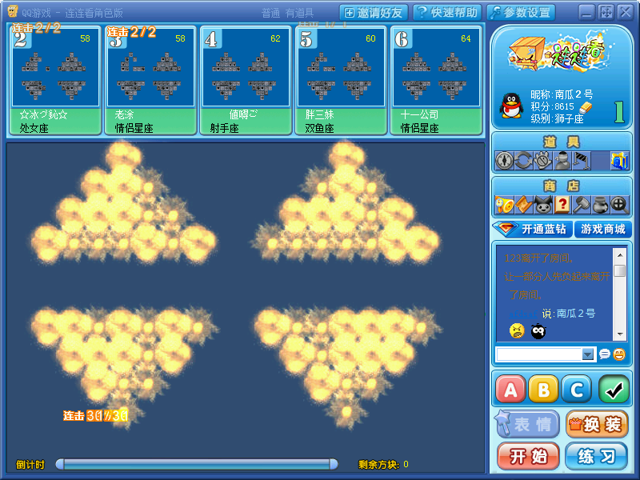
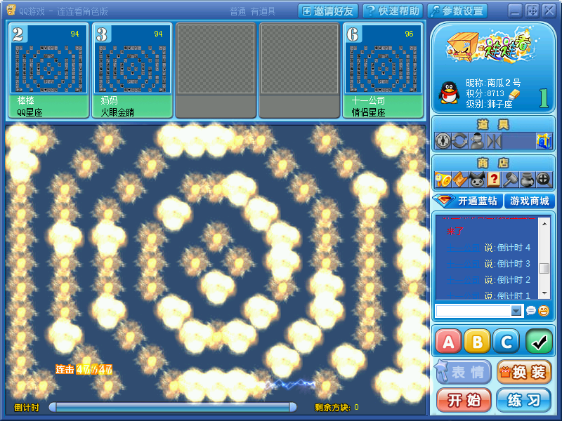

## 名称:
- 连连看外挂

## 简介
- 基于图像识别实现的连连看外挂

## 说明:
- 环境需求：python3.5 + opencv + windowsAPI
- 注意：此程序中的config.py文件是此程序中用到的所有的配置信息，开源的配置信息是针对我这里面所提供的连连看.rar中的连连看游戏的。也就是说这个外挂使用的时候，要打开这个我提供的这个连连看游戏，这套配置不是破解腾讯的游戏的。想要破解腾讯QQ游戏中的连连看，只需要把配置信息修改成与QQ游戏对应的那一套就行，但这套值是多少我不提供。

## 用法:
- 先打开游戏，游戏运行后（游戏开始后），运行脚本。主要要确保游戏窗体不能拖拽到屏幕意外，程序无法识别屏幕以外的数据。

## 原理简述：
- 目标：让计算机替我们执行连连看算法，所以只需要让程序认识图片，并且替我们点击鼠标就可以。
- 实现：
    - 步骤一：对屏幕进行图像分析，将图片的矩阵转化成计算机认识的数组。（通过图像切片和图片比较实现）
    - 步骤二：计算机对数组执行连连看的算法，计算可以连通的点。（单纯的数值运算）
    - 步骤三：让计算机发送鼠标事件，点击可以连通的两个点。（Windows API实现）
    - 重复步骤二、三直到游戏胜利。

## 备注
- 此项目开源仅仅是为了交流学习，大肆流传可能会对其他公司的商业产品造成损失，所以请自觉遵守法律以及道德规范，切勿将其挪作他用，更不可用其获取商业利益！

## 开源协议:
- Apache Licence

## 截图
- 当然，在最后show几张图，展示下外挂的惊人效果，将时间间隔设置为0。

